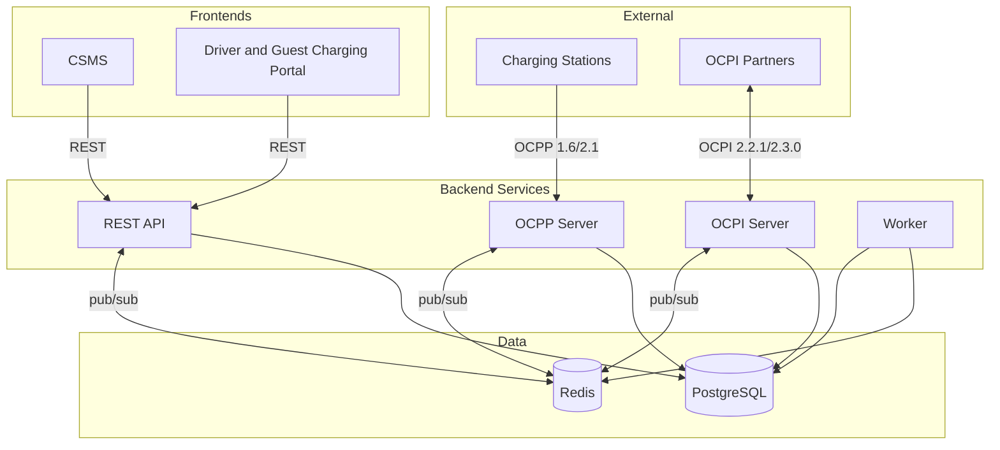

  

<h1 align="center">EVtivity CSMS</h1>

  
  
  
  
  
  
  

  <a href="README.md">English</a> ·
  <strong>Deutsch</strong> ·
  <a href="README.es.md">Español</a> ·
  <a href="README.ko.md">한국어</a> ·
  <a href="README.zh.md">简体中文</a> ·
  <a href="README.zh-TW.md">繁體中文</a>

Ein OCPP-1.6- und 2.1-konformes Charging Station Management System zur Verwaltung von EV-Ladeinfrastruktur. Es übernimmt die Echtzeit-WebSocket-Kommunikation mit Ladestationen, OCPI-2.2.1/2.3.0-Roaming, ISO-15118 Plug and Charge, eine REST-API für Betreiber sowie zwei React-Frontends für Betreiber und Fahrer.

EVtivity integriert KI in das gesamte Betreiber-Erlebnis. Ein Chatbot-Assistent beantwortet natürlichsprachliche Fragen zu Stationen, Sitzungen, Umsatz und Betrieb, indem er API-Endpunkte als Tools aufruft. Ein Support-KI-Assistent verfasst Antworten für Support-Tickets, indem er den gesamten Vorgangskontext erfasst. Beide unterstützen mehrere LLM-Anbieter (Anthropic, OpenAI, Gemini), erlauben Konfiguration auf System- und Benutzerebene, antworten in der bevorzugten Sprache des Betreibers und setzen Sicherheitsmechanismen durch, die das Offenlegen sensibler Daten verhindern.

## Architektur

## Funktionsübersicht

### OCPP-Konformität

| Funktion               | Beschreibung                                                                                                                                                |
| ---------------------- | ----------------------------------------------------------------------------------------------------------------------------------------------------------- |
| Protokollunterstützung | OCPP 1.6 und 2.1 mit gleichzeitigem Multi-Version-Betrieb                                                                                                   |
| Security Profiles      | SP0 bis SP3, einschließlich mTLS-Client-Zertifikat-Authentifizierung                                                                                        |
| Fernsteuerung          | Sitzungen starten/stoppen, Reset, Stecker entriegeln, Ladeprofil setzen                                                                                     |
| Lokale Autorisierung   | Stationsbezogene Autorisierungslisten mit betreiberseitig verwaltetem Push-Sync                                                                             |
| Reservierungen         | Reservierung auf EVSE-Ebene mit Ablaufüberwachung und Fahrerbenachrichtigung                                                                                |
| Stationsmeldungen      | Acht zustandsspezifische Vorlagen (verfügbar, belegt, reserviert, ladend, pausiert, entladend, fehlerhaft, nicht verfügbar) per SetDisplayMessage gerendert |
| Plug and Charge        | ISO-15118-PKI mit Hubject-OPCP- und manuellen Zertifikatsanbietern                                                                                          |

### Stationsverwaltung

| Funktion                | Beschreibung                                                                                                                                                                                                                             |
| ----------------------- | ---------------------------------------------------------------------------------------------------------------------------------------------------------------------------------------------------------------------------------------- |
| Mehrstandort-Hierarchie | Standorte, Stationen, EVSEs und Stecker mit standortbezogener Zugriffssteuerung pro Betreiber                                                                                                                                            |
| Echtzeit-Monitoring     | Live-Steckerstatus, Sitzungsaktivität und Zählerwerte über Server-Sent Events                                                                                                                                                            |
| Stationsbilder          | Pro Station hochladen, taggen und mit dem Flag „für Fahrer sichtbar" veröffentlichen                                                                                                                                                     |
| Firmware-Verwaltung     | Netzwerkweite Firmware-Kampagnen mit stationsweiser Planung und Statusverfolgung                                                                                                                                                         |
| Konfiguration           | Konfigurationsvorlagen mit stationsweiser Driftermittlung und Massenanwendung                                                                                                                                                            |
| Stations-Metriken       | NEVI-Uptime-Compliance, ChargeX-KPIs, Auslastungs- und Fehlerquotenberichte                                                                                                                                                              |
| Popular Times           | Sitzungs-Heatmap nach Tag und Stunde pro Station                                                                                                                                                                                         |
| Ferndiagnose            | Statusmeldungen auslösen, Diagnosedaten abrufen, Fehlerzustände zurücksetzen                                                                                                                                                             |
| Standort-Wartung        | Einmalige oder sofortige Wartungsfenster planen, die Stationen offline nehmen, überlappende Reservierungen stornieren, aktive Sitzungen optional mit Fahrerbenachrichtigung stoppen und ein Wartungs-Badge in der Standortliste anzeigen |

### Lastmanagement

| Funktion          | Beschreibung                                                                            |
| ----------------- | --------------------------------------------------------------------------------------- |
| Lastmanagement    | Standortweites Leistungsbudget mit Gleichverteilungs- und prioritätsbasierter Zuweisung |
| Ladeprofile       | OCPP-Ladeprofil-Auslieferung mit Unterstützung für Composite-Schedules                  |
| Leerlauferkennung | Mehrsignal-Leerlauferkennung (chargingState, Leistungsmesser, Status) mit Karenzzeit    |
| V2G               | Vehicle-to-Grid-Entlade-Statusverfolgung über OCPP-2.1-chargingState                    |

### Abrechnung und Zahlungen

| Funktion                            | Beschreibung                                                                                      |
| ----------------------------------- | ------------------------------------------------------------------------------------------------- |
| Tarif-Engine                        | Pauschal-, Tageszeit-, Wochentags-, Saison-, Feiertags- und Energieschwellen-Tarife               |
| Tarif-Zuordnung                     | Tarifgruppen-Zuweisung auf Fahrer-, Flotten-, Stations- und Standortebene mit Prioritätsauflösung |
| Split-Abrechnung                    | Kostenverfolgung pro Segment, wenn der Tarif während einer Sitzung wechselt                       |
| Leerlauf- und Reservierungsgebühren | Minutengenaue Leerlaufgebühr mit Karenzzeit und minutengenaue Reservierungsgebühr                 |
| Mehrwährungsfähig                   | 10 Währungen mit Intl.NumberFormat-Formatierung                                                   |
| Zahlungsabwicklung                  | Stripe-Vorautorisierung, Capture, Teil- und Vollerstattungen                                      |
| Gast-Laden                          | Karten-Zahlung für nicht authentifizierte Fahrer per QR-Code                                      |
| Rechnungsstellung                   | Sitzungsbelege, Monatsabrechnungen und Umsatzreconciliation                                       |

### Roaming

| Funktion                 | Beschreibung                                                                            |
| ------------------------ | --------------------------------------------------------------------------------------- |
| OCPI 2.2.1 / 2.3.0       | CPO- und eMSP-Rollen mit Unterstützung beider Versionen                                 |
| Partner-Verwaltung       | Credential-Austausch, Endpunkt-Registrierung und Verbindungs-Statusüberwachung          |
| Standortveröffentlichung | Pro-Standort-Veröffentlichungssteuerung mit partnerbezogenen Sichtbarkeitseinstellungen |
| CDR-Erzeugung            | Automatische Erstellung von Charge Detail Records und Push an eMSP-Partner              |
| Token-Autorisierung      | Echtzeit- und Offline-Autorisierung externer Fahrer-Tokens                              |
| Remote-Befehle           | CPO-Befehlsempfänger (START_SESSION, STOP_SESSION, RESERVE_NOW, UNLOCK_CONNECTOR)       |
| Roaming-Stationssuche    | Browsing und Suche in Partnernetzen über das Fahrer-Portal                              |

### Fahrer-Erlebnis

| Funktion                  | Beschreibung                                                                           |
| ------------------------- | -------------------------------------------------------------------------------------- |
| Fahrer-Portal             | Mobile-first Webportal mit QR-Code-Scan, Sitzungsverwaltung und Verlauf                |
| Stationssuche in der Nähe | Standortbezogene Suche mit Kartenansicht und Echtzeit-Verfügbarkeit                    |
| Gast-Laden                | Ladevorgang ohne Konto mit Stripe-Zahlung an der Station                               |
| Aktivitäts-Dashboard      | Monatliche Ladezusammenfassung mit Energie, Kosten und geschätzten Meilen pro Fahrzeug |
| Monatsabrechnungen        | Pro Kalendermonat verfügbare itemisierte Abrechnungen                                  |
| Favoriten                 | Häufig genutzte Stationen speichern und schnell aufrufen                               |
| Flottenverwaltung         | Gruppierung mit flottenspezifischer Preisgestaltung und Token-Zuweisung                |
| Fahrzeugverwaltung        | Fahrzeugprofile zur Energie-zu-Meilen-Schätzung auf Basis realer Effizienzwerte        |
| RFID-Self-Service         | Fahrer fügen RFID-Karten im Portal selbst hinzu und verwalten sie                      |
| In-App-Benachrichtigungen | Echtzeit-Glockensymbol mit Verlaufs-Drawer und Kanal-Präferenzen                       |
| Support-Tickets           | Tickets mit Sitzungs-Verknüpfung, Erstattungsaktionen und S3-Dateianhängen             |
| Benachrichtigungen        | E-Mail und SMS für Sitzungs-, Zahlungs-, Reservierungs- und Support-Ereignisse         |

### KI-gestützter Betrieb

| Funktion                     | Beschreibung                                                                                                                          |
| ---------------------------- | ------------------------------------------------------------------------------------------------------------------------------------- |
| Chatbot-Assistent            | Natürlichsprachlicher Betreiber-Assistent mit Zugriff auf alle API-Endpunkte über einen automatisch erzeugten Tool-Katalog            |
| Zweistufige Tool-Auswahl     | Kategoriebasiertes Tool-Routing hält die Tool-Anzahl pro Anfrage unter dem Anbieter-Limit (128)                                       |
| Support-Case-KI              | Entwürfe von Kundenantworten und internen Notizen aus dem gesamten Vorgangskontext (Nachrichten, Sitzungen, Station, Fahrer)          |
| Multi-Provider-Unterstützung | Anthropic Claude, OpenAI GPT und Google Gemini mit Konfiguration auf System- und Benutzerebene                                        |
| LLM-Parameter                | Konfigurierbare Temperatur, top-p, top-k, System-Prompt und Tonalität auf System- und Benutzerebene                                   |
| Sprachsensible Antworten     | KI antwortet in der bevorzugten Sprache des Betreibers in allen 6 unterstützten Locales                                               |
| Sicherheits-Guardrails       | Blockiert das Offenlegen von Passwörtern und API-Keys, verlangt Bestätigung vor Datenänderungen                                       |
| Auto-generierte Tools        | OpenAPI-Spec-Codegen erzeugt typisierte Tool-Definitionen für alle 500+ Betreiber-Endpunkte                                           |
| Editierbares Chat-UI         | Bearbeiten und erneutes Senden von Benutzernachrichten, Kopieren von Assistant-Antworten, Markdown-Rendering mit scrollbaren Tabellen |

### Nachhaltigkeit

| Funktion               | Beschreibung                                                                                      |
| ---------------------- | ------------------------------------------------------------------------------------------------- |
| CO2-Tracking           | CO2-Einsparung pro Sitzung berechnet aus EPA eGRID und regionalen Netz-Intensitätsdaten von Ember |
| Standort-CO2-Regionen  | Pro Standort eine CO2-Intensitätsregion aus 60 vorinstallierten regionalen Faktoren zuweisen      |
| Dashboard-Integration  | CO2-Statistikkarte auf dem Betreiber-Dashboard mit Tag-zu-Tag-Trend                               |
| Sitzungs-Anzeige       | CO2-Spalte in Sitzungs-Tabellen und Detailseiten für Betreiber und Fahrer                         |
| Nachhaltigkeitsbericht | Monatlicher Trend, Standortaufschlüsselung, Baum-Äquivalent und CSV-Export                        |
| Portal-Integration     | CO2-Auswirkung auf Sitzungsbelegen, Monatsabrechnungen und Aktivitätsseite                        |

### Sicherheit und Zugriff

| Funktion                  | Beschreibung                                                                                   |
| ------------------------- | ---------------------------------------------------------------------------------------------- |
| Authentifizierung         | JWT-basierte Authentifizierung mit rollenbasierter Zugriffssteuerung für Betreiber und Fahrer  |
| SAML-SSO                  | SAML-2.0-Single-Sign-On mit konfigurierbarem IdP, Auto-Provisionierung und Attribut-Mapping    |
| API-Keys                  | Langlebige API-Keys für programmatischen Zugriff, die den Standortzugriff des Erstellers erben |
| Multi-Faktor-Auth         | TOTP-Authenticator-App, E-Mail-Code und SMS-Code                                               |
| Standortzugriffskontrolle | Pro-Betreiber-Standortzuweisung mit Default-Deny-Durchsetzung                                  |
| E-Mail-Verifizierung      | Kontoverifizierung bei Fahrer-Selbstregistrierung vor Portal-Zugriff                           |
| Bot-Schutz                | Google reCAPTCHA v3 auf Betreiber- und Fahrer-Login                                            |
| Audit-Logs                | Aktionsprotokoll für Compliance und Sicherheitsprüfungen                                       |

### Berichte und Analytik

| Funktion              | Beschreibung                                                                           |
| --------------------- | -------------------------------------------------------------------------------------- |
| Dashboards            | Echtzeit-Diagramme für Umsatz, Energie, Sitzungszahlen und Steckerstatus               |
| Berichte              | 9 Berichtstypen, u. a. Energieverbrauch, Umsatz, Auslastung und Fehler                 |
| NEVI-Compliance       | Stations-Uptime-Tracking und ausgenommene Ausfallzeiten gemäß NEVI-Anforderungen       |
| Geplante Auslieferung | Automatisierte Berichtszustellung per E-Mail oder FTP nach konfigurierbaren Zeitplänen |

### Benachrichtigungen und Messaging

| Funktion                  | Beschreibung                                                                        |
| ------------------------- | ----------------------------------------------------------------------------------- |
| Ereignisgesteuerte Alerts | 41 konfigurierbare OCPP-Ereignistypen mit Empfänger, Kanal und Vorlage pro Ereignis |
| Fahrer-Benachrichtigungen | Sitzungs-, Zahlungs-, Reservierungs- und Support-Benachrichtigungen pro Fahrer      |
| Kanäle                    | E-Mail (SMTP), SMS (Twilio), Webhook und In-App-Zustellung                          |
| Vorlagen-Editor           | WYSIWYG-E-Mail-Editor mit Drag-and-Drop-Variableneinfügung und Live-Vorschau        |
| E-Mail-Layout             | Konfigurierbare HTML-Wrapper-Vorlage für alle ausgehenden E-Mails                   |
| Benachrichtigungsverlauf  | Zustellprotokoll mit E-Mail-Vorschau und Inline-Ansicht für SMS/Push                |

### Deployment und Betrieb

| Funktion               | Beschreibung                                                                                            |
| ---------------------- | ------------------------------------------------------------------------------------------------------- |
| Deployment-Optionen    | Docker Compose, Kubernetes-Helm-Chart (Istio/Envoy Gateway) und AWS CDK (ECS)                           |
| Horizontale Skalierung | Zustandslose Dienste mit Redis-basiertem OCPP-Verbindungs-Register über Pods hinweg                     |
| Auto-Scaling           | Kubernetes-HPA für API und OCPP mit WebSocket-fähiger Scale-down-Stabilisierung                         |
| Rate-Limiting          | Konfigurierbares globales und endpunktbasiertes Rate-Limiting mit separaten Auth-Limits                 |
| Observability          | Prometheus-Metriken, Grafana-Dashboards, Loki-Log-Aggregation                                           |
| Konformitäts-Tests     | Integrierter OCTT-1.6/2.1-Testrunner für CSMS- und Ladestations-SUT mit Dashboard und Modul-Ergebnissen |
| Mehrsprachige UI       | 6 Sprachen: Englisch, Deutsch, Spanisch, Koreanisch, vereinfachtes und traditionelles Chinesisch        |
| Responsive Filter      | Filtersteuerung klappt auf Tablet und Mobil in ein Dropdown für alle Listenseiten ein                   |
| Server-Down-Seite      | Freundliche Fehlerseite mit Retry bei unerreichbarer API in CSMS und Portal                             |
| Release-Management     | Automatisierte Versions-Erhöhung über alle Pakete und Helm-Chart per Release-Skript                     |

## Dienste

Beim Deployment per Helm-Chart wird jeder Dienst über eine eigene Subdomain via Gateway API bereitgestellt:

| Dienst             | URL                                | Public Port | Internal Port |
| ------------------ | ---------------------------------- | ----------- | ------------- |
| CSMS-Dashboard     | https://csms.your-domain.com       | 443         | 80            |
| Fahrer-Portal      | https://portal.your-domain.com     | 443         | 80            |
| REST API           | https://api.your-domain.com        | 443         | 3001          |
| OCPP-WebSocket     | wss://ocpp.your-domain.com         | 443         | 8080          |
| OCPP-WebSocket TLS | wss://\<load-balancer-ip\>         | 8443        | 8443          |
| OCPI-Server        | https://ocpi.your-domain.com       | 443         | 3002          |
| Grafana            | https://grafana.your-domain.com    | 443         | 3000          |
| Prometheus         | https://prometheus.your-domain.com | 443         | 9090          |
| API-Dokumentation  | https://api.your-domain.com/docs   | 443         | 3001          |

Alle Hostnamen teilen sich eine einzige Load-Balancer-IP. DNS-Einträge für jeden Hostnamen müssen auf diese IP zeigen. OCPP TLS (Port 8443) wird als separater `LoadBalancer`-Dienst für direkte Stationsverbindungen mit Security Profile 3 (mTLS) bereitgestellt.

## Helm-Chart

Das Kubernetes-Helm-Chart wird in einem separaten Repository gepflegt: [EVtivity/evtivity-csms-helm](https://github.com/EVtivity/evtivity-csms-helm)

## Lizenz

Copyright (c) 2025-2026 EVtivity. Alle Rechte vorbehalten.

Sie dürfen die Software für Ihren eigenen Betrieb herunterladen und ausführen. Sie dürfen die Software nicht kopieren, weiterverbreiten, zurückentwickeln oder als gehostetes oder SaaS-Produkt anbieten. Sie dürfen die Software nicht verkaufen oder anderen Personen den Zugriff in Rechnung stellen.

Vollständige Bedingungen siehe [LICENSE.md](LICENSE.md). Für Lizenzanfragen wenden Sie sich an evtivity@gmail.com.
