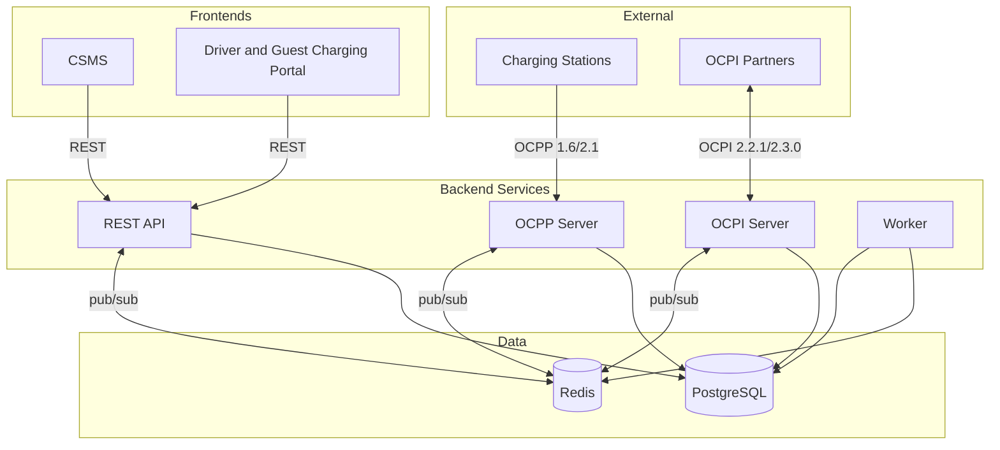

  

<h1 align="center">EVtivity CSMS</h1>

  
  
  
  
  
  
  

  <a href="README.md">English</a> ·
  <a href="README.de.md">Deutsch</a> ·
  <strong>Español</strong> ·
  <a href="README.ko.md">한국어</a> ·
  <a href="README.zh.md">简体中文</a> ·
  <a href="README.zh-TW.md">繁體中文</a>

Un sistema de gestión de estaciones de carga (CSMS) compatible con OCPP 1.6 y 2.1 para gestionar infraestructura de carga de vehículos eléctricos. Gestiona la comunicación WebSocket en tiempo real con las estaciones, roaming OCPI 2.2.1/2.3.0, Plug and Charge ISO 15118, una API REST para operadores y dos frontends en React para operadores y conductores.

EVtivity integra IA en toda la experiencia del operador. Un asistente chatbot responde preguntas en lenguaje natural sobre estaciones, sesiones, ingresos y operaciones llamando a los endpoints de la API como herramientas. Un asistente de IA para soporte redacta respuestas a casos de soporte recopilando el contexto completo del caso. Ambos soportan múltiples proveedores de LLM (Anthropic, OpenAI, Gemini) con parámetros configurables a nivel de sistema y por usuario, responden en el idioma preferido del operador y aplican salvaguardas que evitan la fuga de datos sensibles.

## Arquitectura

## Resumen de funciones

### Cumplimiento OCPP

| Función               | Descripción                                                                                                                                                |
| --------------------- | ---------------------------------------------------------------------------------------------------------------------------------------------------------- |
| Soporte de protocolo  | OCPP 1.6 y 2.1 con operación multi-versión simultánea                                                                                                      |
| Perfiles de seguridad | SP0 a SP3, incluida autenticación mTLS por certificado de cliente                                                                                          |
| Control remoto        | Iniciar/detener sesiones, reset, desbloquear conector, establecer perfil de carga                                                                          |
| Autorización local    | Listas de autorización por estación con sincronización gestionada por el operador                                                                          |
| Reservas              | Reserva a nivel de EVSE con monitorización de expiración y notificación al conductor                                                                       |
| Mensajes de estación  | Ocho plantillas por estado (disponible, ocupado, reservado, cargando, suspendido, descargando, en fallo, no disponible) renderizadas vía SetDisplayMessage |
| Plug and Charge       | PKI ISO 15118 con soporte de proveedor Hubject OPCP y proveedor manual                                                                                     |

### Gestión de estaciones

| Función                       | Descripción                                                                                                                                                                                                                                                    |
| ----------------------------- | -------------------------------------------------------------------------------------------------------------------------------------------------------------------------------------------------------------------------------------------------------------- |
| Jerarquía multi-sitio         | Sitios, estaciones, EVSE y conectores con control de acceso por sitio por operador                                                                                                                                                                             |
| Monitorización en tiempo real | Estado de conector, actividad de sesión y valores del medidor en directo vía server-sent events                                                                                                                                                                |
| Imágenes de estación          | Subir, etiquetar y publicar imágenes por estación con bandera de visibilidad para conductores                                                                                                                                                                  |
| Gestión de firmware           | Campañas de firmware en toda la red con planificación por estación y seguimiento del estado                                                                                                                                                                    |
| Configuración                 | Plantillas de configuración con detección de deriva por estación y aplicación masiva                                                                                                                                                                           |
| Métricas de estación          | Cumplimiento de uptime NEVI, KPI de ChargeX, tasa de utilización e informes de tasa de fallos                                                                                                                                                                  |
| Horas populares               | Mapa de calor de frecuencia de sesiones por día y hora por estación                                                                                                                                                                                            |
| Diagnóstico remoto            | Disparar notificaciones de estado, recuperar diagnósticos, limpiar estados de fallo                                                                                                                                                                            |
| Mantenimiento por sitio       | Programar ventanas de mantenimiento únicas o inmediatas que ponen estaciones fuera de línea, cancelan reservas solapadas, opcionalmente detienen sesiones activas con notificación al conductor y muestran una insignia de Mantenimiento en la lista de sitios |

### Carga inteligente

| Función                  | Descripción                                                                              |
| ------------------------ | ---------------------------------------------------------------------------------------- |
| Gestión de carga         | Presupuesto de potencia por sitio con asignación en partes iguales y por prioridad       |
| Perfiles de carga        | Entrega de perfiles de carga OCPP con soporte de schedule compuesto                      |
| Detección de inactividad | Detección multi-señal (chargingState, medidor de potencia, estado) con periodo de gracia |
| V2G                      | Seguimiento de estado de descarga vehículo-a-red vía chargingState de OCPP 2.1           |

### Facturación y pagos

| Función                          | Descripción                                                                                      |
| -------------------------------- | ------------------------------------------------------------------------------------------------ |
| Motor de tarifas                 | Tarifas planas, por horario, día de la semana, estación, festivo y umbral de energía             |
| Asignación de precios            | Asignación de grupos de tarifa a conductor, flota, estación y sitio con resolución por prioridad |
| Split billing                    | Seguimiento de coste por segmento cuando la tarifa cambia durante una sesión                     |
| Tarifas de inactividad y reserva | Tarifa por minuto de inactividad con periodo de gracia y tarifa por minuto de reserva            |
| Multi-moneda                     | 10 monedas con formato Intl.NumberFormat                                                         |
| Procesamiento de pagos           | Preautorización Stripe, captura, devoluciones parciales y completas                              |
| Carga de invitados               | Pago con tarjeta para conductores no autenticados vía código QR                                  |
| Facturación                      | Recibos de sesión, extractos mensuales y reconciliación de ingresos                              |

### Roaming

| Función                        | Descripción                                                                               |
| ------------------------------ | ----------------------------------------------------------------------------------------- |
| OCPI 2.2.1 / 2.3.0             | Roles CPO y eMSP con soporte de doble versión                                             |
| Gestión de partners            | Intercambio de credenciales, registro de endpoints y monitorización de estado de conexión |
| Publicación de ubicaciones     | Control de publicación por sitio con ajustes de visibilidad a nivel de partner            |
| Generación de CDR              | Creación automática de registros de detalle de carga y push a partners eMSP               |
| Autorización de tokens         | Autorización en tiempo real y offline de tokens externos de conductores                   |
| Comandos remotos               | Receptor de comandos CPO (START_SESSION, STOP_SESSION, RESERVE_NOW, UNLOCK_CONNECTOR)     |
| Búsqueda de estaciones roaming | Navegación y búsqueda de estaciones de red partner desde el portal del conductor          |

### Experiencia del conductor

| Función               | Descripción                                                                              |
| --------------------- | ---------------------------------------------------------------------------------------- |
| Portal del conductor  | Portal web mobile-first con escaneo QR, gestión de sesiones e historial                  |
| Búsqueda cercana      | Búsqueda con geolocalización, vista de mapa y disponibilidad en tiempo real              |
| Carga de invitados    | Flujo de carga sin cuenta con pago Stripe en la estación                                 |
| Panel de actividad    | Resumen mensual con energía, coste y millas estimadas por vehículo                       |
| Extractos mensuales   | Extractos itemizados por mes calendario                                                  |
| Favoritos             | Guardar y acceder rápidamente a estaciones frecuentes                                    |
| Gestión de flotas     | Agrupación en flotas con precios específicos y asignación de tokens a conductores        |
| Gestión de vehículos  | Perfiles de vehículo para estimación de energía-a-millas según eficiencia real           |
| Autoservicio RFID     | Los conductores añaden y gestionan sus tarjetas RFID desde el portal                     |
| Notificaciones in-app | Campana de notificaciones en tiempo real con cajón de historial y preferencias por canal |
| Casos de soporte      | Tickets de soporte con enlace a sesiones, acciones de reembolso y adjuntos en S3         |
| Notificaciones        | Email y SMS para eventos de sesión, estado de pago, reservas y casos de soporte          |

### Operaciones impulsadas por IA

| Función                                  | Descripción                                                                                                                           |
| ---------------------------------------- | ------------------------------------------------------------------------------------------------------------------------------------- |
| Asistente chatbot                        | Asistente en lenguaje natural para operadores con acceso a todos los endpoints API mediante un catálogo de herramientas autogenerado  |
| Selección de herramientas en dos niveles | Enrutamiento por categoría mantiene el conteo de herramientas por petición bajo el límite del proveedor (128)                         |
| IA para casos de soporte                 | Redacción de respuestas al cliente y notas internas a partir del contexto completo del caso (mensajes, sesiones, estación, conductor) |
| Soporte multi-proveedor                  | Anthropic Claude, OpenAI GPT y Google Gemini con configuración a nivel de sistema y por usuario                                       |
| Parámetros del LLM                       | Temperatura, top-p, top-k, system prompt y tono configurables a nivel de sistema y por usuario                                        |
| Respuestas según el idioma               | La IA responde en el idioma preferido del operador en los 6 locales soportados                                                        |
| Salvaguardas de seguridad                | Bloquea fuga de contraseñas y claves API, exige confirmación antes de modificaciones de datos                                         |
| Herramientas autogeneradas               | El codegen del spec OpenAPI produce definiciones tipadas para los 500+ endpoints del operador                                         |
| Chat editable                            | Editar y reenviar mensajes del usuario, copiar respuestas del asistente, renderizado Markdown con tablas con scroll                   |

### Sostenibilidad

| Función                       | Descripción                                                                                  |
| ----------------------------- | -------------------------------------------------------------------------------------------- |
| Seguimiento de carbono        | CO2 evitado por sesión calculado desde EPA eGRID e intensidad regional de Ember              |
| Regiones de carbono por sitio | Asignar una región de intensidad de carbono a cada sitio a partir de 60 factores precargados |
| Integración en el dashboard   | Tarjeta de CO2 evitado en el dashboard del operador con tendencia día a día                  |
| Visualización en sesiones     | Columna CO2 en tabla de sesiones y páginas de detalle para operador y conductor              |
| Informe de sostenibilidad     | Gráfico de tendencia mensual, desglose por sitio, equivalente en árboles y exportación CSV   |
| Integración con el portal     | Impacto de carbono en recibos, extractos mensuales y página de actividad                     |

### Seguridad y acceso

| Función                    | Descripción                                                                                      |
| -------------------------- | ------------------------------------------------------------------------------------------------ |
| Autenticación              | Auth basada en JWT con control de acceso por rol para operadores y conductores                   |
| SAML SSO                   | Inicio de sesión único SAML 2.0 con IdP configurable, autoaprovisionamiento y mapeo de atributos |
| Claves de API              | Claves API de larga duración para acceso programático que heredan el acceso a sitios del creador |
| Auth multifactor           | App TOTP, código por email y código por SMS                                                      |
| Control de acceso a sitios | Asignación por operador con denegación por defecto                                               |
| Verificación de email      | Verificación de cuenta en el autorregistro del conductor antes del acceso al portal              |
| Protección anti-bots       | Google reCAPTCHA v3 en el inicio de sesión de operadores y conductores                           |
| Audit logs                 | Registro de acciones del operador para cumplimiento y revisión de seguridad                      |

### Informes y analítica

| Función            | Descripción                                                                                  |
| ------------------ | -------------------------------------------------------------------------------------------- |
| Dashboards         | Gráficos en tiempo real de ingresos, energía, sesiones y estado de conectores                |
| Informes           | 9 tipos de informe, incluidos consumo de energía, ingresos, utilización y fallos             |
| Cumplimiento NEVI  | Seguimiento de uptime de estaciones y gestión de tiempos de inactividad excluidos según NEVI |
| Entrega programada | Entrega automatizada de informes por email o FTP en horarios configurables                   |

### Notificaciones y mensajería

| Función                     | Descripción                                                                                        |
| --------------------------- | -------------------------------------------------------------------------------------------------- |
| Alertas basadas en eventos  | 41 tipos de evento OCPP configurables con destinatario, canal y plantilla por evento               |
| Notificaciones al conductor | Notificaciones de sesión, pago, reservas y soporte por conductor                                   |
| Canales                     | Email (SMTP), SMS (Twilio), webhook y entrega in-app                                               |
| Editor de plantillas        | Editor WYSIWYG para email con inserción de variables por arrastrar-y-soltar y vista previa en vivo |
| Layout de email             | Plantilla envolvente HTML configurable aplicada a todos los correos salientes                      |
| Historial de notificaciones | Registro de entrega con vista previa de email y expansión inline para SMS/push                     |

### Despliegue y operación

| Función                  | Descripción                                                                                                     |
| ------------------------ | --------------------------------------------------------------------------------------------------------------- |
| Opciones de despliegue   | Docker Compose, Helm chart de Kubernetes (Istio/Envoy Gateway) y AWS CDK (ECS)                                  |
| Escalado horizontal      | Servicios sin estado con registro de conexiones OCPP en Redis entre pods                                        |
| Auto-scaling             | HPA de Kubernetes para API y OCPP con estabilización de scale-down consciente de WebSocket                      |
| Rate limiting            | Rate limiting global y por endpoint configurable con límites separados para auth                                |
| Observabilidad           | Métricas Prometheus, dashboards Grafana, agregación de logs con Loki                                            |
| Pruebas de conformidad   | Runner OCTT 1.6 y 2.1 integrado para SUT de CSMS y de estación con informe en dashboard y resultados por módulo |
| UI multi-idioma          | 6 idiomas: inglés, alemán, español, coreano, chino simplificado y tradicional                                   |
| Filtros responsivos      | Los controles de filtro colapsan en un dropdown en tablet y móvil en todas las listas                           |
| Página de servidor caído | Página de error amigable con reintento cuando la API no responde, en CSMS y Portal                              |
| Gestión de releases      | Bump automático de versión en todos los paquetes y el Helm chart mediante el script de release                  |

## Servicios

Cuando se despliega con el Helm chart, cada servicio se expone en su propio subdominio vía Gateway API:

| Servicio             | URL                                | Puerto público | Puerto interno |
| -------------------- | ---------------------------------- | -------------- | -------------- |
| Dashboard CSMS       | https://csms.your-domain.com       | 443            | 80             |
| Portal del conductor | https://portal.your-domain.com     | 443            | 80             |
| REST API             | https://api.your-domain.com        | 443            | 3001           |
| WebSocket OCPP       | wss://ocpp.your-domain.com         | 443            | 8080           |
| WebSocket OCPP TLS   | wss://\<load-balancer-ip\>         | 8443           | 8443           |
| Servidor OCPI        | https://ocpi.your-domain.com       | 443            | 3002           |
| Grafana              | https://grafana.your-domain.com    | 443            | 3000           |
| Prometheus           | https://prometheus.your-domain.com | 443            | 9090           |
| Documentación API    | https://api.your-domain.com/docs   | 443            | 3001           |

Todos los hostnames comparten una sola IP de load balancer. Los registros DNS de cada hostname deben apuntar a esa IP. OCPP TLS (puerto 8443) se aprovisiona como un servicio `LoadBalancer` separado para conexiones directas con Security Profile 3 (mTLS).

## Helm Chart

El Helm chart de Kubernetes se mantiene en un repositorio separado: [EVtivity/evtivity-csms-helm](https://github.com/EVtivity/evtivity-csms-helm)

## Licencia

Copyright (c) 2025-2026 EVtivity. Todos los derechos reservados.

Puedes descargar y ejecutar el software para tus propias operaciones. No puedes copiar, redistribuir, hacer ingeniería inversa ni ofrecer el software como producto alojado o SaaS. No puedes venderlo ni cobrar a otros por acceder a él.

Consulta [LICENSE.md](LICENSE.md) para los términos completos. Para consultas de licencia, escribe a evtivity@gmail.com.
