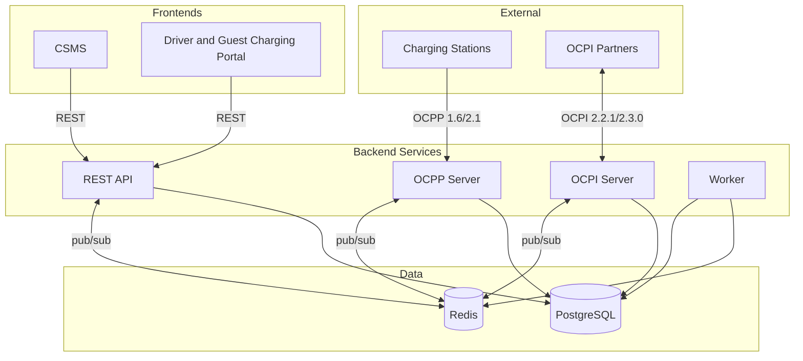

  

<h1 align="center">EVtivity CSMS</h1>

  
  
  
  
  
  
  

  <a href="README.md">English</a> ·
  <a href="README.de.md">Deutsch</a> ·
  <a href="README.es.md">Español</a> ·
  <strong>한국어</strong> ·
  <a href="README.zh.md">简体中文</a> ·
  <a href="README.zh-TW.md">繁體中文</a>

EV 충전 인프라를 관리하기 위한 OCPP 1.6 및 2.1 호환 충전소 관리 시스템(CSMS)입니다. 충전소와의 실시간 WebSocket 통신, OCPI 2.2.1/2.3.0 로밍, ISO 15118 Plug and Charge, 운영자용 REST API, 그리고 운영자와 드라이버를 위한 두 개의 React 프런트엔드를 제공합니다.

EVtivity는 운영 경험 전반에 AI를 통합합니다. 챗봇 어시스턴트는 API 엔드포인트를 도구로 호출하여 충전소, 세션, 매출, 운영에 대한 자연어 질문에 답합니다. 지원 AI 어시스턴트는 케이스의 전체 컨텍스트를 수집해 고객 지원 답변 초안을 작성합니다. 두 어시스턴트 모두 다중 LLM 공급자(Anthropic, OpenAI, Gemini)를 지원하며 시스템 및 사용자별 매개변수 설정이 가능하고, 운영자의 선호 언어로 답하며, 민감 정보 유출을 방지하는 보안 가드레일을 적용합니다.

## 아키텍처

## 기능 개요

### OCPP 준수

| 기능            | 설명                                                                                                                     |
| --------------- | ------------------------------------------------------------------------------------------------------------------------ |
| 프로토콜 지원   | OCPP 1.6 및 2.1 동시 다중 버전 운용                                                                                      |
| 보안 프로파일   | SP0~SP3, mTLS 클라이언트 인증서 인증 포함                                                                                |
| 원격 제어       | 세션 시작/중지, 리셋, 커넥터 잠금 해제, 충전 프로파일 설정                                                               |
| 로컬 인증       | 운영자가 관리하는 푸시 동기화 기반의 스테이션별 인증 목록                                                                |
| 예약            | EVSE 단위 예약 및 만료 모니터링, 드라이버 알림                                                                           |
| 스테이션 메시지 | 8가지 상태별 템플릿(사용 가능, 사용 중, 예약됨, 충전 중, 일시 중지, 방전 중, 결함, 사용 불가)을 SetDisplayMessage로 표시 |
| Plug and Charge | ISO 15118 PKI, Hubject OPCP 및 수동 인증서 공급자 지원                                                                   |

### 스테이션 관리

| 기능              | 설명                                                                                                                                                                                |
| ----------------- | ----------------------------------------------------------------------------------------------------------------------------------------------------------------------------------- |
| 다중 사이트 계층  | 사이트, 스테이션, EVSE, 커넥터와 운영자별 사이트 접근 제어                                                                                                                          |
| 실시간 모니터링   | server-sent events로 커넥터 상태, 세션 활동, 미터값 실시간 표시                                                                                                                     |
| 스테이션 이미지   | 스테이션별 업로드, 태그 부여, 드라이버 공개 플래그로 게시                                                                                                                           |
| 펌웨어 관리       | 네트워크 전체 펌웨어 캠페인, 스테이션별 스케줄링과 상태 추적                                                                                                                        |
| 구성              | 구성 템플릿, 스테이션 드리프트 감지, 일괄 적용                                                                                                                                      |
| 스테이션 메트릭   | NEVI 가동률 준수, ChargeX KPI, 가동률 및 결함률 보고                                                                                                                                |
| 인기 시간대       | 스테이션별 요일/시간대 세션 빈도 히트맵                                                                                                                                             |
| 원격 진단         | 상태 알림 트리거, 진단 데이터 조회, 결함 상태 초기화                                                                                                                                |
| 사이트별 유지보수 | 일회성 또는 즉시 유지보수 윈도우를 예약하여 스테이션을 오프라인 처리하고 겹치는 예약을 취소하며, 선택적으로 활성 세션을 중지(드라이버 알림)하고, 사이트 목록에 유지보수 배지를 표시 |

### 스마트 충전

| 기능          | 설명                                                          |
| ------------- | ------------------------------------------------------------- |
| 부하 관리     | 사이트 단위 전력 예산과 균등 배분 및 우선순위 기반 할당       |
| 충전 프로파일 | OCPP 충전 프로파일 전달 및 composite schedule 지원            |
| 유휴 감지     | 다중 신호 유휴 감지(chargingState, 전력계, 상태) 및 유예 기간 |
| V2G           | OCPP 2.1 chargingState 기반 V2G 방전 상태 추적                |

### 청구 및 결제

| 기능                | 설명                                                                     |
| ------------------- | ------------------------------------------------------------------------ |
| 요금 엔진           | 정액, 시간대별, 요일별, 시즌별, 공휴일, 에너지 임계 요금                 |
| 가격 할당           | 드라이버, 플리트, 스테이션, 사이트 수준의 요금 그룹 할당과 우선순위 해석 |
| 분할 청구           | 세션 중 요금 변경 시 세그먼트별 비용 추적                                |
| 유휴 및 예약 수수료 | 유예 기간이 있는 분당 유휴 수수료, 분당 예약 수수료                      |
| 다중 통화           | Intl.NumberFormat 형식의 10개 통화                                       |
| 결제 처리           | Stripe 사전 승인, 캡처, 일부/전액 환불                                   |
| 게스트 충전         | QR 코드 기반 비인증 드라이버용 카드 결제                                 |
| 인보이스            | 세션 영수증, 월간 명세서, 매출 정산                                      |

### 로밍

| 기능               | 설명                                                                      |
| ------------------ | ------------------------------------------------------------------------- |
| OCPI 2.2.1 / 2.3.0 | CPO 및 eMSP 역할, 두 버전 동시 지원                                       |
| 파트너 관리        | 자격 증명 교환, 엔드포인트 등록, 연결 상태 모니터링                       |
| 위치 게시          | 사이트별 게시 제어, 파트너 단위 가시성 설정                               |
| CDR 생성           | 충전 상세 기록 자동 생성 및 eMSP 파트너 푸시                              |
| 토큰 인증          | 외부 드라이버 토큰의 실시간 및 오프라인 인증                              |
| 원격 명령          | CPO 명령 수신(START_SESSION, STOP_SESSION, RESERVE_NOW, UNLOCK_CONNECTOR) |
| 로밍 스테이션 검색 | 드라이버 포털에서 파트너 네트워크 스테이션 탐색 및 검색                   |

### 드라이버 경험

| 기능               | 설명                                                   |
| ------------------ | ------------------------------------------------------ |
| 드라이버 포털      | 모바일 우선 웹 포털, QR 코드 스캔, 세션 관리, 이력     |
| 주변 스테이션 검색 | 위치 기반 검색, 지도 보기, 실시간 가용성               |
| 게스트 충전        | 계정 없이 스테이션에서 Stripe 결제                     |
| 활동 대시보드      | 차량별 에너지, 비용, 예상 마일을 포함한 월간 충전 요약 |
| 월간 명세서        | 달력 월 단위의 항목별 세션 명세서                      |
| 즐겨찾기           | 자주 사용하는 스테이션 저장 및 빠른 접근               |
| 플리트 관리        | 플리트 그룹화, 플리트별 요금 및 토큰 할당              |
| 차량 관리          | 실주행 효율 기반의 에너지-마일 추정 차량 프로필        |
| RFID 셀프 서비스   | 드라이버가 포털에서 자신의 RFID 카드를 직접 추가/관리  |
| 인앱 알림          | 실시간 알림 벨과 이력 드로어, 채널별 환경설정          |
| 지원 케이스        | 세션 연결, 환불 작업, S3 첨부가 가능한 지원 티켓       |
| 알림               | 세션, 결제, 예약, 지원 이벤트에 대한 이메일/SMS        |

### AI 기반 운영

| 기능                | 설명                                                                                        |
| ------------------- | ------------------------------------------------------------------------------------------- |
| 챗봇 어시스턴트     | 자동 생성된 도구 카탈로그를 통해 모든 API 엔드포인트에 접근하는 자연어 운영자 어시스턴트    |
| 2단계 도구 선택     | 카테고리 기반 라우팅으로 요청당 도구 수를 공급자 한도(128) 이내로 유지                      |
| 지원 케이스 AI      | 메시지·세션·스테이션·드라이버까지 포함한 전체 케이스 컨텍스트로 응답 초안 및 내부 메모 작성 |
| 다중 공급자 지원    | Anthropic Claude, OpenAI GPT, Google Gemini, 시스템 및 사용자 단위 구성                     |
| LLM 매개변수        | temperature, top-p, top-k, 시스템 프롬프트, 톤을 시스템 및 사용자 단위로 구성               |
| 언어 인식 응답      | AI가 운영자의 선호 언어(6개 로케일)로 응답                                                  |
| 보안 가드레일       | 비밀번호와 API 키 노출 차단, 데이터 변경 전 확인 요구                                       |
| 자동 생성 도구      | OpenAPI 스펙 코드젠으로 500+ 운영자 엔드포인트의 타입 도구 정의 생성                        |
| 편집 가능한 채팅 UI | 사용자 메시지 편집·재전송, 어시스턴트 응답 복사, 스크롤 가능한 표를 포함한 마크다운 렌더링  |

### 지속 가능성

| 기능              | 설명                                                                   |
| ----------------- | ---------------------------------------------------------------------- |
| 탄소 추적         | EPA eGRID와 Ember의 지역 전력망 강도를 기반으로 세션별 CO2 절감량 계산 |
| 사이트 탄소 지역  | 사전 로드된 60개 지역 계수에서 각 사이트에 탄소 강도 지역 지정         |
| 대시보드 통합     | 운영자 대시보드에 일일 추세를 포함한 CO2 절감량 통계 카드              |
| 세션 표시         | 운영자/드라이버용 세션 테이블과 상세 페이지의 CO2 열                   |
| 지속가능성 보고서 | 월별 추세 차트, 사이트별 분해, 나무 환산, CSV 내보내기                 |
| 포털 통합         | 영수증, 월간 명세서, 활동 페이지에서 탄소 영향                         |

### 보안과 접근

| 기능             | 설명                                                            |
| ---------------- | --------------------------------------------------------------- |
| 인증             | JWT 기반 인증과 운영자·드라이버용 역할 기반 접근 제어           |
| SAML SSO         | 구성 가능한 IdP, 자동 프로비저닝, 속성 매핑을 갖춘 SAML 2.0 SSO |
| API 키           | 생성자의 사이트 접근 권한을 상속하는 장기 API 키                |
| 다중 인증        | TOTP 앱, 이메일 코드, SMS 코드                                  |
| 사이트 접근 제어 | 운영자별 사이트 할당 및 기본 차단                               |
| 이메일 검증      | 드라이버 셀프 가입 시 포털 접근 전에 계정 검증                  |
| 봇 보호          | 운영자/드라이버 로그인에 Google reCAPTCHA v3                    |
| 감사 로그        | 컴플라이언스와 보안 검토를 위한 운영자 작업 로그                |

### 리포트와 분석

| 기능      | 설명                                                           |
| --------- | -------------------------------------------------------------- |
| 대시보드  | 매출, 에너지, 세션 수, 커넥터 상태에 대한 실시간 차트          |
| 리포트    | 에너지 소비, 매출, 가동률, 결함 등 9종 리포트                  |
| NEVI 준수 | NEVI 요구사항에 따른 스테이션 가동률 추적과 제외 다운타임 관리 |
| 예약 발송 | 이메일 또는 FTP로 구성 가능한 일정에 따른 자동 리포트 발송     |

### 알림과 메시징

| 기능             | 설명                                                                    |
| ---------------- | ----------------------------------------------------------------------- |
| 이벤트 기반 알림 | 이벤트별 수신자·채널·템플릿을 구성하는 41개 OCPP 이벤트 유형            |
| 드라이버 알림    | 드라이버별 세션, 결제, 예약, 지원 케이스 알림                           |
| 채널             | 이메일(SMTP), SMS(Twilio), 웹훅, 인앱                                   |
| 템플릿 편집기    | 드래그 앤 드롭 변수 삽입과 라이브 미리보기가 있는 WYSIWYG 이메일 편집기 |
| 이메일 레이아웃  | 모든 보내는 이메일에 적용되는 구성 가능한 HTML 래퍼                     |
| 알림 이력        | 이메일 미리보기와 SMS/푸시 인라인 확장이 포함된 전송 로그               |

### 배포와 운영

| 기능             | 설명                                                                                               |
| ---------------- | -------------------------------------------------------------------------------------------------- |
| 배포 옵션        | Docker Compose, Kubernetes Helm 차트(Istio/Envoy Gateway), AWS CDK (ECS)                           |
| 수평 확장        | 무상태 서비스와 파드 간 Redis 기반 OCPP 연결 레지스트리                                            |
| 오토스케일링     | WebSocket을 고려한 스케일다운 안정화를 갖춘 API/OCPP용 Kubernetes HPA                              |
| 레이트 리미팅    | 전역/엔드포인트별 레이트 리미트와 인증용 별도 한도 구성                                            |
| 관찰가능성       | Prometheus 메트릭, Grafana 대시보드, Loki 로그 수집                                                |
| 컨포먼스 테스트  | CSMS 및 충전소 SUT를 대상으로 한 내장 OCTT 1.6/2.1 테스트 러너, 대시보드 리포트와 모듈별 결과 제공 |
| 다국어 UI        | 6개 언어: 영어, 독일어, 스페인어, 한국어, 간체/번체 중국어                                         |
| 반응형 필터      | 모든 목록 페이지의 필터가 태블릿/모바일에서 드롭다운으로 접힘                                      |
| 서버 다운 페이지 | API 미응답 시 CSMS/포털에서 재시도 가능한 친절한 에러 페이지                                       |
| 릴리스 관리      | 릴리스 스크립트로 전체 패키지와 Helm 차트의 버전 자동 올림                                         |

## 서비스

Helm 차트로 배포할 때 각 서비스는 Gateway API를 통해 자체 하위 도메인으로 노출됩니다:

| 서비스             | URL                                | 공개 포트 | 내부 포트 |
| ------------------ | ---------------------------------- | --------- | --------- |
| CSMS 대시보드      | https://csms.your-domain.com       | 443       | 80        |
| 드라이버 포털      | https://portal.your-domain.com     | 443       | 80        |
| REST API           | https://api.your-domain.com        | 443       | 3001      |
| OCPP WebSocket     | wss://ocpp.your-domain.com         | 443       | 8080      |
| OCPP WebSocket TLS | wss://\<load-balancer-ip\>         | 8443      | 8443      |
| OCPI 서버          | https://ocpi.your-domain.com       | 443       | 3002      |
| Grafana            | https://grafana.your-domain.com    | 443       | 3000      |
| Prometheus         | https://prometheus.your-domain.com | 443       | 9090      |
| API 문서           | https://api.your-domain.com/docs   | 443       | 3001      |

모든 호스트네임은 단일 로드 밸런서 IP를 공유합니다. 각 호스트네임의 DNS 레코드를 해당 IP로 지정해야 합니다. OCPP TLS(포트 8443)는 Security Profile 3(mTLS)을 사용한 스테이션 직접 연결을 위해 별도의 `LoadBalancer` 서비스로 프로비저닝됩니다.

## Helm 차트

Kubernetes Helm 차트는 별도 저장소에서 관리됩니다: [EVtivity/evtivity-csms-helm](https://github.com/EVtivity/evtivity-csms-helm)

## 라이선스

Copyright (c) 2025-2026 EVtivity. 모든 권리 보유.

여러분은 자체 운영을 위해 이 소프트웨어를 다운로드하고 실행할 수 있습니다. 소프트웨어를 복제, 재배포, 역공학하거나 호스팅 또는 SaaS 제품으로 제공할 수 없습니다. 소프트웨어를 판매하거나 다른 사람에게 접근 비용을 청구할 수 없습니다.

전체 약관은 [LICENSE.md](LICENSE.md)를 참조하세요. 라이선스 문의는 evtivity@gmail.com 으로 보내주세요.
