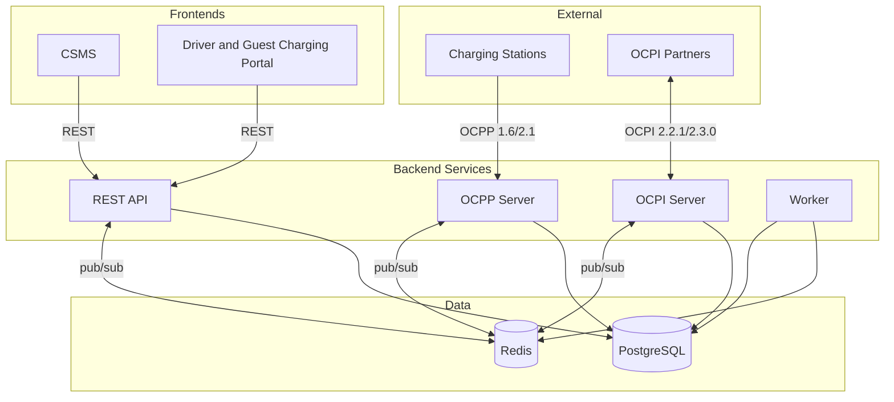

  

<h1 align="center">EVtivity CSMS</h1>

  
  
  
  
  
  
  

  <strong>English</strong> ·
  <a href="README.de.md">Deutsch</a> ·
  <a href="README.es.md">Español</a> ·
  <a href="README.ko.md">한국어</a> ·
  <a href="README.zh.md">简体中文</a> ·
  <a href="README.zh-TW.md">繁體中文</a>

An OCPP 1.6 and 2.1 compliant Charging Station Management System for managing EV charging infrastructure. Handles real-time WebSocket communication with charging stations, OCPI 2.2.1/2.3.0 roaming, ISO 15118 Plug and Charge, a REST API for operators, and two React frontends for operators and drivers.

EVtivity integrates AI across the operator experience. A chatbot assistant answers natural-language questions about stations, sessions, revenue, and operations by calling API endpoints as tools. A support AI assistant drafts replies for customer support cases by gathering full case context. Both support multiple LLM providers (Anthropic, OpenAI, Gemini) with configurable parameters at system and per-user levels, respond in the operator's preferred language, and enforce security guardrails that prevent leaking sensitive data.

## Architecture

## Feature Overview

### OCPP Compliance

| Feature             | Description                                                                                                                                                               |
| ------------------- | ------------------------------------------------------------------------------------------------------------------------------------------------------------------------- |
| Protocol Support    | OCPP 1.6 and 2.1 with simultaneous multi-version operation                                                                                                                |
| Security Profiles   | SP0 through SP3, including mTLS client certificate authentication                                                                                                         |
| Remote Control      | Start/stop sessions, reset, unlock connector, set charging profile                                                                                                        |
| Local Authorization | Per-station authorization lists with operator-managed push sync                                                                                                           |
| Reservations        | EVSE-level reservation with expiry monitoring and driver notification                                                                                                     |
| Station Messages    | Eight state-specific templates (available, occupied, reserved, charging, suspended, discharging, faulted, unavailable) rendered to station displays via SetDisplayMessage |
| Plug and Charge     | ISO 15118 PKI with Hubject OPCP and manual certificate provider support                                                                                                   |

### Station Management

| Feature              | Description                                                                                                                                                                                                                |
| -------------------- | -------------------------------------------------------------------------------------------------------------------------------------------------------------------------------------------------------------------------- |
| Multi-site Hierarchy | Sites, stations, EVSEs, and connectors with per-operator site access control                                                                                                                                               |
| Real-time Monitoring | Live connector status, session activity, and meter values via server-sent events                                                                                                                                           |
| Station Images       | Upload, tag, and publish images per station with driver-visible flag                                                                                                                                                       |
| Firmware Management  | Network-wide firmware campaigns with per-station scheduling and status tracking                                                                                                                                            |
| Configuration        | Configuration templates with station drift detection and bulk apply                                                                                                                                                        |
| Station Metrics      | NEVI uptime compliance, ChargeX KPIs, utilization rate, and fault rate reporting                                                                                                                                           |
| Popular Times        | Session frequency heatmap by day and hour per station                                                                                                                                                                      |
| Remote Diagnostics   | Trigger status notifications, retrieve diagnostics, clear fault states                                                                                                                                                     |
| Per-site Maintenance | Schedule one-off or immediate maintenance windows that take stations offline, cancel overlapping reservations, optionally stop active sessions with driver notification, and surface a Maintenance badge on the sites list |

### Smart Charging

| Feature           | Description                                                                        |
| ----------------- | ---------------------------------------------------------------------------------- |
| Load Management   | Site-level power budget with equal-share and priority-based allocation             |
| Charging Profiles | OCPP charging profile delivery with composite schedule support                     |
| Idle Detection    | Multi-signal idle detection (chargingState, power meter, status) with grace period |
| V2G               | Vehicle-to-grid discharging state tracking via OCPP 2.1 chargingState              |

### Billing and Payments

| Feature                   | Description                                                                                 |
| ------------------------- | ------------------------------------------------------------------------------------------- |
| Tariff Engine             | Flat, time-of-day, day-of-week, seasonal, holiday, and energy-threshold tariffs             |
| Pricing Assignment        | Tariff group assignment at driver, fleet, station, and site levels with priority resolution |
| Split Billing             | Per-segment cost tracking when tariff changes mid-session                                   |
| Idle and Reservation Fees | Per-minute idle fee with grace period and per-minute reservation fee                        |
| Multi-currency            | 10 currencies with Intl.NumberFormat formatting                                             |
| Payment Processing        | Stripe pre-authorization, capture, partial and full refunds                                 |
| Guest Charging            | Card-on-file payment for unauthenticated drivers via QR code                                |
| Invoicing                 | Session receipts, monthly statements, and revenue reconciliation                            |

### Roaming

| Feature                | Description                                                                        |
| ---------------------- | ---------------------------------------------------------------------------------- |
| OCPI 2.2.1 / 2.3.0     | CPO and eMSP roles with dual-version support                                       |
| Partner Management     | Credential exchange, endpoint registration, and connection status monitoring       |
| Location Publishing    | Per-site publish control with partner-level visibility settings                    |
| CDR Generation         | Automatic charge detail record creation and push to eMSP partners                  |
| Token Authorization    | Real-time and offline authorization of external driver tokens                      |
| Remote Commands        | CPO commands receiver (START_SESSION, STOP_SESSION, RESERVE_NOW, UNLOCK_CONNECTOR) |
| Roaming Station Search | Driver portal browse and search of partner network stations                        |

### Driver Experience

| Feature               | Description                                                                       |
| --------------------- | --------------------------------------------------------------------------------- |
| Driver Portal         | Mobile-first web portal with QR code scanning, session management, and history    |
| Nearby Station Search | Location-aware station search with map view and real-time availability            |
| Guest Charging        | No-account charging flow with Stripe payment at the station                       |
| Activity Dashboard    | Monthly charging summary with energy, cost, and estimated miles by vehicle        |
| Monthly Statements    | Itemized session statements available per calendar month                          |
| Favorites             | Save and quick-access frequently used stations                                    |
| Fleet Management      | Fleet grouping with fleet-specific pricing and driver token assignment            |
| Vehicle Management    | Vehicle profiles for energy-to-miles estimation based on real-world efficiency    |
| RFID Self-service     | Drivers add and manage their own RFID cards from the portal                       |
| In-app Notifications  | Real-time notification bell with history drawer and per-channel preferences       |
| Support Cases         | Support tickets with session linking, refund actions, and S3 file attachments     |
| Notifications         | Email and SMS for session events, payment status, reservations, and support cases |

### AI-Powered Operations

| Feature                  | Description                                                                                            |
| ------------------------ | ------------------------------------------------------------------------------------------------------ |
| Chatbot Assistant        | Natural-language operator assistant with access to all API endpoints via auto-generated tool catalog   |
| Two-tier Tool Selection  | Category-based tool routing keeps per-request tool count under provider limits (128)                   |
| Support Case AI          | Draft customer replies and internal notes from full case context (messages, sessions, station, driver) |
| Multi-provider Support   | Anthropic Claude, OpenAI GPT, and Google Gemini with per-user and system-level configuration           |
| LLM Parameters           | Configurable temperature, top-p, top-k, system prompt, and tone at system and per-user levels          |
| Language-aware Responses | AI responds in the operator's preferred language across all 6 supported locales                        |
| Security Guardrails      | Blocks password and API key leaking, requires confirmation before data modifications                   |
| Auto-generated Tools     | OpenAPI spec codegen produces typed tool definitions for all 500+ operator endpoints                   |
| Editable Chat            | Edit and resend user messages, copy assistant responses, markdown rendering with scrollable tables     |

### Sustainability

| Feature               | Description                                                                       |
| --------------------- | --------------------------------------------------------------------------------- |
| Carbon Tracking       | CO2 avoided per session computed from EPA eGRID and Ember regional grid intensity |
| Site Carbon Regions   | Assign a carbon intensity region to each site from 60 pre-loaded regional factors |
| Dashboard Integration | CO2 avoided stat card on the operator dashboard with day-over-day trend           |
| Session Display       | CO2 column in sessions table and detail pages for both operator and driver views  |
| Sustainability Report | Monthly trend chart, site breakdown table, trees equivalent, and CSV export       |
| Portal Integration    | Carbon impact on session receipts, monthly statements, and activity page          |

### Security and Access

| Feature             | Description                                                                         |
| ------------------- | ----------------------------------------------------------------------------------- |
| Authentication      | JWT-based auth with role-based access control for operators and drivers             |
| SAML SSO            | SAML 2.0 single sign-on with configurable IdP, auto-provisioning, attribute mapping |
| API Keys            | Long-lived API keys for programmatic access, inheriting the creator's site access   |
| Multi-factor Auth   | TOTP authenticator app, email code, and SMS code options                            |
| Site Access Control | Per-operator site assignment with default-deny enforcement                          |
| Email Verification  | Account verification on driver self-registration before portal access is granted    |
| Bot Protection      | Google reCAPTCHA v3 on operator and driver login                                    |
| Audit Logs          | Access log of operator actions for compliance and security review                   |

### Reporting and Analytics

| Feature            | Description                                                                    |
| ------------------ | ------------------------------------------------------------------------------ |
| Dashboards         | Real-time revenue, energy, session count, and connector status charts          |
| Reports            | 9 report types including energy consumption, revenue, utilization, and faults  |
| NEVI Compliance    | Station uptime tracking and excluded downtime management per NEVI requirements |
| Scheduled Delivery | Automated report delivery by email or FTP on configurable schedules            |

### Notifications and Messaging

| Feature              | Description                                                                      |
| -------------------- | -------------------------------------------------------------------------------- |
| Event-driven Alerts  | 41 configurable OCPP event types with per-event recipient, channel, and template |
| Driver Notifications | Session, payment, reservation, and support case notifications per driver         |
| Channels             | Email (SMTP), SMS (Twilio), webhook, and in-app delivery                         |
| Template Editor      | WYSIWYG email editor with drag-and-drop variable insertion and live preview      |
| Email Layout         | Configurable HTML wrapper template applied to all outgoing emails                |
| Notification History | Delivery log with email preview and SMS/push inline expand                       |

### Deployment and Operations

| Feature             | Description                                                                                                                         |
| ------------------- | ----------------------------------------------------------------------------------------------------------------------------------- |
| Deployment Options  | Docker Compose, Kubernetes Helm chart (Istio/Envoy Gateway), and AWS CDK (ECS)                                                      |
| Horizontal Scaling  | Stateless services with Redis-backed OCPP connection registry across pods                                                           |
| Auto-scaling        | Kubernetes HPA for API and OCPP with WebSocket-aware scale-down stabilization                                                       |
| Rate Limiting       | Configurable global and per-endpoint rate limiting with separate auth rate limits                                                   |
| Observability       | Prometheus metrics, Grafana dashboards, Loki log aggregation                                                                        |
| Conformance Testing | Built-in OCTT 1.6 and 2.1 conformance test runner for CSMS and Charging Station SUT with dashboard reporting and per-module results |
| Multi-language UI   | 6 languages: English, German, Spanish, Korean, Simplified and Traditional Chinese                                                   |
| Responsive Filters  | Filter controls collapse into dropdown on tablet and mobile for all list pages                                                      |
| Server-down Page    | Friendly error page with retry when API is unreachable, on both CSMS and Portal                                                     |
| Release Management  | Automated version bumping across all packages and Helm chart via release script                                                     |

## Services

When deployed with the Helm chart, each service is exposed on its own subdomain via Gateway API:

| Service            | URL                                | Public Port | Internal Port |
| ------------------ | ---------------------------------- | ----------- | ------------- |
| CSMS dashboard     | https://csms.your-domain.com       | 443         | 80            |
| Driver portal      | https://portal.your-domain.com     | 443         | 80            |
| REST API           | https://api.your-domain.com        | 443         | 3001          |
| OCPP WebSocket     | wss://ocpp.your-domain.com         | 443         | 8080          |
| OCPP WebSocket TLS | wss://\<load-balancer-ip\>         | 8443        | 8443          |
| OCPI server        | https://ocpi.your-domain.com       | 443         | 3002          |
| Grafana            | https://grafana.your-domain.com    | 443         | 3000          |
| Prometheus         | https://prometheus.your-domain.com | 443         | 9090          |
| API Docs           | https://api.your-domain.com/docs   | 443         | 3001          |

All hostnames share a single load balancer IP. DNS records for each hostname must point to that IP. OCPP TLS (port 8443) is provisioned as a separate `LoadBalancer` service for direct station connections using Security Profile 3 (mTLS).

## Helm Chart

The Kubernetes Helm chart is maintained in a separate repository: [EVtivity/evtivity-csms-helm](https://github.com/EVtivity/evtivity-csms-helm)

## License

Copyright (c) 2025-2026 EVtivity. All rights reserved.

You may download and run the software for your own operations. You may not copy, redistribute, reverse engineer, or offer the software as a hosted or SaaS product. You may not sell or charge others for access to the software.

See [LICENSE.md](LICENSE.md) for full terms. For licensing inquiries, contact evtivity@gmail.com.
