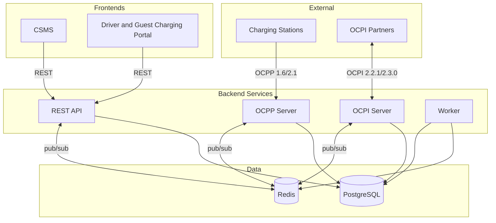

  

<h1 align="center">EVtivity CSMS</h1>

  
  
  
  
  
  
  

  <a href="README.md">English</a> ·
  <a href="README.de.md">Deutsch</a> ·
  <a href="README.es.md">Español</a> ·
  <a href="README.ko.md">한국어</a> ·
  <a href="README.zh.md">简体中文</a> ·
  <strong>繁體中文</strong>

一套相容 OCPP 1.6 與 2.1 的充電樁管理系統（CSMS），用於管理電動車充電基礎設施。系統支援與充電樁的即時 WebSocket 通訊、OCPI 2.2.1/2.3.0 漫遊、ISO 15118 隨插即充，並提供營運者 REST API 以及營運者與車主兩個 React 前端。

EVtivity 在整個營運體驗中整合 AI。聊天助手透過將 API 端點視為工具呼叫，回答關於充電樁、工作階段、營收與營運的自然語問題。客服 AI 助手會蒐集完整工單脈絡，協助起草客戶回覆。兩者皆支援多個 LLM 供應商（Anthropic、OpenAI、Gemini），可在系統層級與個別使用者層級設定參數，並以營運者偏好的語言回覆，同時透過安全護欄避免敏感資料外洩。

## 架構

## 功能總覽

### OCPP 相容

| 功能         | 說明                                                                                          |
| ------------ | --------------------------------------------------------------------------------------------- |
| 通訊協定支援 | OCPP 1.6 與 2.1 同時多版本運作                                                                |
| 安全設定檔   | SP0 至 SP3，包含 mTLS 用戶端憑證認證                                                          |
| 遠端控制     | 啟動/停止工作階段、重置、解鎖連接器、設定充電曲線                                             |
| 本地授權     | 由營運者管理推送同步的樁級授權清單                                                            |
| 預約         | EVSE 等級預約，含到期監控與駕駛人通知                                                         |
| 充電樁訊息   | 八種狀態樣板（可用、占用、預約、充電中、暫停、放電、故障、不可用）透過 SetDisplayMessage 顯示 |
| 隨插即充     | ISO 15118 PKI，支援 Hubject OPCP 與手動憑證提供者                                             |

### 充電樁管理

| 功能       | 說明                                                                                                                               |
| ---------- | ---------------------------------------------------------------------------------------------------------------------------------- |
| 多場站階層 | 場站、充電樁、EVSE 與連接器，按營運者進行場站存取控制                                                                              |
| 即時監控   | 透過 server-sent events 即時呈現連接器狀態、工作階段活動與電錶讀值                                                                 |
| 充電樁影像 | 按樁上傳、加標籤並以「駕駛人可見」旗標發佈                                                                                         |
| 韌體管理   | 全網韌體升級活動，可按樁排程並追蹤狀態                                                                                             |
| 組態       | 組態樣板，含樁級組態偏移偵測與大量套用                                                                                             |
| 充電樁指標 | NEVI 在線率合規、ChargeX KPI、利用率與故障率報告                                                                                   |
| 熱門時段   | 按充電樁呈現的日/時段工作階段頻率熱圖                                                                                              |
| 遠端診斷   | 觸發狀態通知、取得診斷、清除故障                                                                                                   |
| 場站維護   | 安排單次或立即生效的維護視窗：將充電樁離線、取消重疊預約，可選擇性地優雅停止活動中的工作階段並通知駕駛人，並在場站清單顯示維護徽章 |

### 智慧充電

| 功能     | 說明                                                    |
| -------- | ------------------------------------------------------- |
| 負載管理 | 場站級電力預算，支援平均分配與按優先權分配              |
| 充電曲線 | OCPP 充電曲線下發，支援複合排程                         |
| 閒置偵測 | 多訊號閒置偵測（chargingState、功率計、狀態），含寬限期 |
| V2G      | 以 OCPP 2.1 chargingState 追蹤車對網放電狀態            |

### 計費與支付

| 功能           | 說明                                                     |
| -------------- | -------------------------------------------------------- |
| 費率引擎       | 平價、時段、星期、季節、節日與能量門檻費率               |
| 費率分配       | 在駕駛人、車隊、樁與場站層級指派費率群組，並按優先權解析 |
| 分段計費       | 工作階段中費率變動時，按區段追蹤費用                     |
| 閒置與預約費用 | 含寬限期的每分鐘閒置費與每分鐘預約費                     |
| 多幣別         | 10 種貨幣，使用 Intl.NumberFormat 格式                   |
| 支付處理       | Stripe 預先授權、扣款、部分與全額退款                    |
| 訪客充電       | 透過 QR Code 為未登入駕駛人提供卡片支付                  |
| 發票           | 工作階段票據、月對帳單與營收對帳                         |

### 漫遊

| 功能               | 說明                                                                       |
| ------------------ | -------------------------------------------------------------------------- |
| OCPI 2.2.1 / 2.3.0 | 同時支援 CPO 與 eMSP 角色及雙版本                                          |
| 合作夥伴管理       | 憑證交換、端點註冊與連線狀態監控                                           |
| 站點發佈           | 按場站控制發佈，並依夥伴設定可見性                                         |
| CDR 產生           | 自動產生充電明細紀錄並推送給 eMSP 夥伴                                     |
| 權杖授權           | 對外部駕駛人權杖的即時與離線授權                                           |
| 遠端指令           | CPO 指令接收（START_SESSION、STOP_SESSION、RESERVE_NOW、UNLOCK_CONNECTOR） |
| 漫遊充電樁搜尋     | 在駕駛人入口瀏覽與搜尋夥伴網路的充電樁                                     |

### 駕駛人體驗

| 功能           | 說明                                                  |
| -------------- | ----------------------------------------------------- |
| 駕駛人入口     | 行動優先網頁入口，含 QR Code 掃描、工作階段管理與歷程 |
| 附近充電樁搜尋 | 位置感知搜尋，含地圖檢視與即時可用性                  |
| 訪客充電       | 不需帳號，於充電樁端用 Stripe 完成付款                |
| 活動儀表板     | 月度充電摘要，含車輛能量、費用與估算里程              |
| 月對帳單       | 以日曆月份提供的工作階段明細對帳單                    |
| 我的最愛       | 儲存常用樁並快速存取                                  |
| 車隊管理       | 車隊分群、車隊專屬費率與駕駛人權杖指派                |
| 車輛管理       | 以實際效率估算能量轉換里程的車輛檔案                  |
| RFID 自助      | 駕駛人於入口自行新增與管理 RFID 卡                    |
| 應用內通知     | 即時通知鈴鐺，含歷程抽屜與每通道偏好                  |
| 客服工單       | 含工作階段連結、退款動作與 S3 附件的客服工單          |
| 通知           | 工作階段、付款、預約與客服事件的電子郵件與 SMS 通知   |

### AI 驅動營運

| 功能           | 說明                                                                    |
| -------------- | ----------------------------------------------------------------------- |
| 聊天助手       | 透過自動產生的工具目錄存取所有 API 端點的自然語營運助手                 |
| 兩階段工具選擇 | 按類別路由，使每次請求的工具數量低於供應商上限（128）                   |
| 客服 AI        | 從完整工單脈絡（訊息、工作階段、樁、駕駛人）起草客戶回覆與內部備註      |
| 多供應商支援   | Anthropic Claude、OpenAI GPT 與 Google Gemini，可在系統與使用者層級設定 |
| LLM 參數       | 系統與使用者層級可設定 temperature、top-p、top-k、系統提示與語氣        |
| 語言感知回覆   | AI 以營運者偏好的語言（6 種地區）回覆                                   |
| 安全護欄       | 阻擋密碼與 API 金鑰外洩，資料變更前要求確認                             |
| 自動產生工具   | 由 OpenAPI 規格代碼產生器產出 500+ 個營運者端點的型別工具定義           |
| 可編輯聊天     | 可編輯與重送使用者訊息、複製助手回覆，含可捲動表格的 Markdown 呈現      |

### 永續性

| 功能         | 說明                                                            |
| ------------ | --------------------------------------------------------------- |
| 碳追蹤       | 依據 EPA eGRID 與 Ember 區域電網強度計算每次工作階段的 CO2 減量 |
| 場站碳區域   | 自 60 個預載區域因子中為每個場站指派碳強度區域                  |
| 儀表板整合   | 營運者儀表板上的 CO2 減量統計卡，含日對日趨勢                   |
| 工作階段呈現 | 在營運者與駕駛人端的工作階段表與詳情頁顯示 CO2 欄               |
| 永續性報告   | 月度趨勢圖、按場站細分、等效樹木與 CSV 匯出                     |
| 入口整合     | 在票據、月對帳單與活動頁呈現碳影響                              |

### 安全與存取

| 功能         | 說明                                                  |
| ------------ | ----------------------------------------------------- |
| 身分驗證     | 以 JWT 為基礎的營運者與駕駛人驗證，以及角色式存取控制 |
| SAML SSO     | 可設定 IdP 的 SAML 2.0 單一登入，含自動配置與屬性對應 |
| API 金鑰     | 長效 API 金鑰，繼承建立者的場站存取                   |
| 多因子驗證   | TOTP 應用、Email 驗證碼與 SMS 驗證碼                  |
| 場站存取控制 | 按營運者指派場站，預設拒絕                            |
| Email 驗證   | 駕駛人自助註冊在進入入口前需完成帳號驗證              |
| 防爬蟲       | 營運者與駕駛人登入採用 Google reCAPTCHA v3            |
| 稽核日誌     | 用於法遵與資安檢視的營運者操作紀錄                    |

### 報表與分析

| 功能      | 說明                                             |
| --------- | ------------------------------------------------ |
| 儀表板    | 營收、能量、工作階段數量與連接器狀態的即時圖表   |
| 報表      | 9 種報表，含能量消耗、營收、利用率與故障         |
| NEVI 合規 | 依 NEVI 要求追蹤充電樁在線率並管理排除的停機時間 |
| 排程寄送  | 透過電子郵件或 FTP 依可設定排程自動寄送報表      |

### 通知與訊息

| 功能         | 說明                                                        |
| ------------ | ----------------------------------------------------------- |
| 事件驅動告警 | 41 種可設定的 OCPP 事件類型，含按事件設定收件人、通道與樣板 |
| 駕駛人通知   | 駕駛人個別的工作階段、付款、預約與客服通知                  |
| 通道         | 電子郵件（SMTP）、SMS（Twilio）、Webhook 與應用內           |
| 樣板編輯器   | 含拖放變數與即時預覽的 WYSIWYG 郵件編輯器                   |
| 郵件版型     | 套用於所有外寄郵件的可設定 HTML 包覆樣板                    |
| 通知歷程     | 寄送日誌，含郵件預覽與 SMS/推播展開                         |

### 部署與運維

| 功能           | 說明                                                                                |
| -------------- | ----------------------------------------------------------------------------------- |
| 部署選項       | Docker Compose、Kubernetes Helm Chart（Istio/Envoy Gateway）與 AWS CDK（ECS）       |
| 水平擴展       | 無狀態服務，跨 Pod 使用 Redis 為基礎的 OCPP 連線註冊                                |
| 自動擴縮       | 對 API 與 OCPP 的 Kubernetes HPA，含可感知 WebSocket 的縮容穩定化                   |
| 速率限制       | 可設定全域與按端點的速率限制，並對驗證設獨立限額                                    |
| 可觀測性       | Prometheus 指標、Grafana 儀表板、Loki 日誌彙整                                      |
| 一致性測試     | 內建 OCTT 1.6/2.1 測試執行器，可對 CSMS 與充電樁 SUT 執行並輸出儀表板報告與模組結果 |
| 多語言 UI      | 6 種語言：英文、德文、西班牙文、韓文、簡體與繁體中文                                |
| 響應式篩選     | 所有列表頁面的篩選控制項在平板與行動上摺疊為下拉                                    |
| 伺服器離線頁面 | 當 API 無法連線時，CSMS 與入口顯示可重試的友善錯誤頁                                |
| 發行管理       | 透過發行腳本自動為所有套件與 Helm Chart 提升版號                                    |

## 服務

以 Helm Chart 部署時，每個服務透過 Gateway API 暴露於各自的子網域：

| 服務               | URL                                | 公開連接埠 | 內部連接埠 |
| ------------------ | ---------------------------------- | ---------- | ---------- |
| CSMS 儀表板        | https://csms.your-domain.com       | 443        | 80         |
| 駕駛人入口         | https://portal.your-domain.com     | 443        | 80         |
| REST API           | https://api.your-domain.com        | 443        | 3001       |
| OCPP WebSocket     | wss://ocpp.your-domain.com         | 443        | 8080       |
| OCPP WebSocket TLS | wss://\<load-balancer-ip\>         | 8443       | 8443       |
| OCPI 服務          | https://ocpi.your-domain.com       | 443        | 3002       |
| Grafana            | https://grafana.your-domain.com    | 443        | 3000       |
| Prometheus         | https://prometheus.your-domain.com | 443        | 9090       |
| API 文件           | https://api.your-domain.com/docs   | 443        | 3001       |

所有主機名共用同一個負載平衡 IP。請將各主機名的 DNS 紀錄指向該 IP。OCPP TLS（連接埠 8443）以獨立的 `LoadBalancer` 服務佈建，供使用 Security Profile 3（mTLS）的充電樁直連。

## Helm Chart

Kubernetes Helm Chart 於獨立的儲存庫維護：[EVtivity/evtivity-csms-helm](https://github.com/EVtivity/evtivity-csms-helm)

## 授權

Copyright (c) 2025-2026 EVtivity. 保留所有權利。

您可以為自己的營運下載並執行本軟體。您不得複製、再散布、逆向工程，或將本軟體作為託管或 SaaS 產品提供。您不得販售本軟體或向他人收取存取費用。

完整條款請參閱 [LICENSE.md](LICENSE.md)。授權相關事宜請來信 evtivity@gmail.com。
