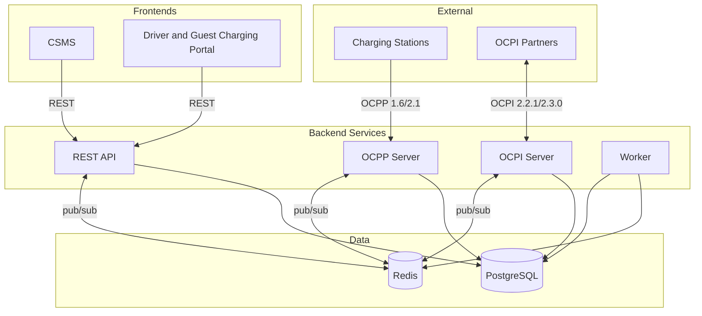

  

<h1 align="center">EVtivity CSMS</h1>

  
  
  
  
  
  
  

  <a href="README.md">English</a> ·
  <a href="README.de.md">Deutsch</a> ·
  <a href="README.es.md">Español</a> ·
  <a href="README.ko.md">한국어</a> ·
  <strong>简体中文</strong> ·
  <a href="README.zh-TW.md">繁體中文</a>

一套兼容 OCPP 1.6 和 2.1 的充电桩管理系统（CSMS），用于管理电动车充电基础设施。系统支持与充电桩的实时 WebSocket 通信、OCPI 2.2.1/2.3.0 漫游、ISO 15118 即插即充，并提供运营商 REST API 以及运营商和车主两个 React 前端。

EVtivity 在整个运营体验中集成了 AI。聊天助手通过将 API 端点作为工具来调用，回答关于充电桩、会话、营收和运营的自然语言问题。客服 AI 助手通过收集完整工单上下文来起草客户回复。两者均支持多种 LLM 服务商（Anthropic、OpenAI、Gemini），可在系统级和按用户配置参数，使用运营商首选语言进行回复，并通过安全防护避免泄露敏感数据。

## 架构

## 功能概览

### OCPP 合规

| 功能         | 描述                                                                                            |
| ------------ | ----------------------------------------------------------------------------------------------- |
| 协议支持     | OCPP 1.6 与 2.1 同时多版本运行                                                                  |
| 安全配置文件 | SP0 至 SP3，含 mTLS 客户端证书认证                                                              |
| 远程控制     | 启动/停止会话、复位、解锁连接器、设置充电曲线                                                   |
| 本地授权     | 由运营商管理推送同步的桩级授权列表                                                              |
| 预约         | EVSE 级预约，自动到期监控并通知车主                                                             |
| 充电桩消息   | 八种状态模板（可用、占用、预约、充电中、暂停、放电、故障、不可用），通过 SetDisplayMessage 推送 |
| 即插即充     | ISO 15118 PKI，支持 Hubject OPCP 与手动证书提供者                                               |

### 充电桩管理

| 功能       | 描述                                                                                                                 |
| ---------- | -------------------------------------------------------------------------------------------------------------------- |
| 多场站层级 | 场站、充电桩、EVSE 与连接器，按运营商进行场站访问控制                                                                |
| 实时监控   | 通过 server-sent events 实时呈现连接器状态、会话活动与电表读数                                                       |
| 充电桩图片 | 按桩上传、打标签并使用车主可见标志发布                                                                               |
| 固件管理   | 全网固件升级活动，可按桩调度并跟踪状态                                                                               |
| 配置       | 配置模板，含桩级配置漂移检测和批量下发                                                                               |
| 充电桩指标 | NEVI 在线率合规、ChargeX KPI、利用率与故障率报告                                                                     |
| 高峰时段   | 按充电桩呈现的日/小时会话频率热图                                                                                    |
| 远程诊断   | 触发状态通知、获取诊断、清除故障                                                                                     |
| 场站维护   | 安排一次性或立即生效的维护窗口：使桩离线、取消重叠预约，可选地优雅停止活动会话并通知车主，并在场站列表中显示维护标识 |

### 智能充电

| 功能     | 描述                                                  |
| -------- | ----------------------------------------------------- |
| 负载管理 | 场站级功率预算，支持平均分配与基于优先级的分配        |
| 充电曲线 | OCPP 充电曲线下发，支持复合调度                       |
| 空闲检测 | 多信号空闲检测（chargingState、功率计、状态）含宽限期 |
| V2G      | 基于 OCPP 2.1 chargingState 的 V2G 放电状态跟踪       |

### 计费与支付

| 功能           | 描述                                             |
| -------------- | ------------------------------------------------ |
| 费率引擎       | 平价、时段、星期、季节、节日与能量阈值费率       |
| 费率分配       | 按车主、车队、桩、场站分配费率组，并按优先级解析 |
| 分段计费       | 会话中费率变化时按段跟踪成本                     |
| 空闲与预约费用 | 含宽限期的按分钟空闲费、按分钟预约费             |
| 多币种         | 10 种货币，使用 Intl.NumberFormat 格式化         |
| 支付处理       | Stripe 预授权、扣款、部分与全额退款              |
| 访客充电       | 通过二维码为未登录车主提供卡支付                 |
| 开票           | 会话票据、月度对账单与营收对账                   |

### 漫游

| 功能               | 描述                                                                       |
| ------------------ | -------------------------------------------------------------------------- |
| OCPI 2.2.1 / 2.3.0 | 同时支持 CPO 与 eMSP 角色及双版本                                          |
| 合作伙伴管理       | 凭据交换、端点注册与连接状态监控                                           |
| 站点发布           | 按场站发布控制，并按合作伙伴设置可见性                                     |
| CDR 生成           | 自动生成充电明细记录并推送给 eMSP 合作伙伴                                 |
| 令牌授权           | 外部车主令牌的实时与离线授权                                               |
| 远程命令           | CPO 命令接收（START_SESSION、STOP_SESSION、RESERVE_NOW、UNLOCK_CONNECTOR） |
| 漫游充电桩搜索     | 在车主门户浏览与搜索合作伙伴网络的充电桩                                   |

### 车主体验

| 功能       | 描述                                             |
| ---------- | ------------------------------------------------ |
| 车主门户   | 移动优先的网页门户，含二维码扫描、会话管理与历史 |
| 附近桩搜索 | 基于位置的搜索，含地图视图与实时可用性           |
| 访客充电   | 无需账号，在桩侧使用 Stripe 完成支付             |
| 活动仪表盘 | 月度充电摘要，含按车辆估算的能量、费用与里程     |
| 月度对账单 | 按自然月提供的会话明细对账单                     |
| 收藏       | 保存常用桩并快速访问                             |
| 车队管理   | 车队分组与车队级费率，可分配车主令牌             |
| 车辆管理   | 基于真实效率的车辆档案，用于能量到里程估算       |
| RFID 自助  | 车主在门户中自行添加与管理 RFID 卡               |
| 应用内通知 | 实时通知铃铛，含历史抽屉与按渠道偏好             |
| 工单       | 含会话关联、退款操作与 S3 附件的工单             |
| 通知       | 会话、支付、预约与工单的邮件与短信通知           |

### AI 驱动的运营

| 功能         | 描述                                                                |
| ------------ | ------------------------------------------------------------------- |
| 聊天助手     | 通过自动生成的工具目录访问所有 API 端点的自然语言运营助手           |
| 两级工具选择 | 按类别路由，使每次请求的工具数量低于供应商上限（128）               |
| 客服 AI      | 基于完整工单上下文（消息、会话、桩、车主）起草客户回复与内部备注    |
| 多供应商支持 | Anthropic Claude、OpenAI GPT、Google Gemini，可在系统级和用户级配置 |
| LLM 参数     | 可在系统级和用户级配置 temperature、top-p、top-k、系统提示词与语气  |
| 语言感知回复 | AI 以运营商首选语言（6 种地区）回复                                 |
| 安全防护     | 阻止密码与 API 密钥泄露，数据修改前要求确认                         |
| 自动生成工具 | OpenAPI 规范代码生成产出 500+ 个运营商端点的类型化工具定义          |
| 可编辑聊天   | 可编辑并重发用户消息、复制助手回复、Markdown 渲染含可滚动表格       |

### 可持续性

| 功能         | 描述                                                          |
| ------------ | ------------------------------------------------------------- |
| 碳跟踪       | 基于 EPA eGRID 与 Ember 区域电网强度计算每次会话的 CO2 减排量 |
| 场站碳区域   | 在 60 个预置区域因子中为每个场站分配碳强度区域                |
| 仪表盘集成   | 运营商仪表盘上的 CO2 减排统计卡，含日环比                     |
| 会话展示     | 在运营商与车主端的会话表与详情中展示 CO2 列                   |
| 可持续性报告 | 月度趋势图、按场站细分、等效树木与 CSV 导出                   |
| 门户集成     | 在票据、月对账单与活动页展示碳影响                            |

### 安全与访问

| 功能         | 描述                                                  |
| ------------ | ----------------------------------------------------- |
| 身份认证     | 基于 JWT 的运营商与车主认证及基于角色的访问控制       |
| SAML SSO     | 可配置 IdP 的 SAML 2.0 单点登录，含自动配给与属性映射 |
| API 密钥     | 长期 API 密钥，继承创建者的场站访问权限               |
| 多因子认证   | TOTP 应用、邮箱码与短信码                             |
| 场站访问控制 | 按运营商分配场站，默认拒绝                            |
| 邮箱验证     | 车主自助注册时在门户访问前完成账户验证                |
| 防爬虫       | 运营商与车主登录使用 Google reCAPTCHA v3              |
| 审计日志     | 运营操作日志，便于合规与安全审查                      |

### 报告与分析

| 功能      | 描述                                       |
| --------- | ------------------------------------------ |
| 仪表盘    | 营收、能量、会话数与连接器状态的实时图表   |
| 报告      | 9 种报告，含能耗、营收、利用率与故障       |
| NEVI 合规 | 按 NEVI 要求跟踪桩在线率并管理排除停机时间 |
| 计划发送  | 通过邮件或 FTP 按可配置计划自动发送报告    |

### 通知与消息

| 功能         | 描述                                                        |
| ------------ | ----------------------------------------------------------- |
| 事件驱动告警 | 41 种可配置的 OCPP 事件类型，可按事件配置接收人、通道与模板 |
| 车主通知     | 按车主提供会话、支付、预约与工单通知                        |
| 通道         | 邮件（SMTP）、短信（Twilio）、Webhook 与应用内              |
| 模板编辑器   | WYSIWYG 邮件编辑器，支持拖拽变量与实时预览                  |
| 邮件版式     | 适用于所有外发邮件的可配置 HTML 包装模板                    |
| 通知历史     | 发送日志，含邮件预览与短信/推送内联展开                     |

### 部署与运维

| 功能           | 描述                                                                              |
| -------------- | --------------------------------------------------------------------------------- |
| 部署选项       | Docker Compose、Kubernetes Helm Chart（Istio/Envoy Gateway）与 AWS CDK（ECS）     |
| 水平扩展       | 无状态服务，跨 Pod 使用基于 Redis 的 OCPP 连接注册                                |
| 自动扩缩       | API 与 OCPP 的 Kubernetes HPA，缩容稳定化感知 WebSocket                           |
| 限流           | 可配置全局与按端点限流，并对认证设独立限制                                        |
| 可观测性       | Prometheus 指标、Grafana 仪表盘、Loki 日志聚合                                    |
| 一致性测试     | 面向 CSMS 与充电桩 SUT 的内置 OCTT 1.6/2.1 测试运行器，提供仪表盘报告与按模块结果 |
| 多语言 UI      | 6 种语言：英语、德语、西班牙语、韩语、简体与繁体中文                              |
| 响应式筛选     | 所有列表页的筛选控件在平板与移动端折叠为下拉                                      |
| 服务器宕机页面 | CSMS 与门户在 API 不可达时显示带重试的友好错误页                                  |
| 发布管理       | 通过发布脚本自动提升所有包与 Helm Chart 的版本                                    |

## 服务

通过 Helm Chart 部署时，每个服务通过 Gateway API 公开在各自子域名上：

| 服务               | URL                                | 公网端口 | 内部端口 |
| ------------------ | ---------------------------------- | -------- | -------- |
| CSMS 仪表盘        | https://csms.your-domain.com       | 443      | 80       |
| 车主门户           | https://portal.your-domain.com     | 443      | 80       |
| REST API           | https://api.your-domain.com        | 443      | 3001     |
| OCPP WebSocket     | wss://ocpp.your-domain.com         | 443      | 8080     |
| OCPP WebSocket TLS | wss://\<load-balancer-ip\>         | 8443     | 8443     |
| OCPI 服务          | https://ocpi.your-domain.com       | 443      | 3002     |
| Grafana            | https://grafana.your-domain.com    | 443      | 3000     |
| Prometheus         | https://prometheus.your-domain.com | 443      | 9090     |
| API 文档           | https://api.your-domain.com/docs   | 443      | 3001     |

所有主机名共享同一个负载均衡 IP。请将各主机名的 DNS 记录指向该 IP。OCPP TLS（端口 8443）作为独立的 `LoadBalancer` 服务以供使用 Security Profile 3（mTLS）的桩直连。

## Helm Chart

Kubernetes Helm Chart 在独立仓库中维护：[EVtivity/evtivity-csms-helm](https://github.com/EVtivity/evtivity-csms-helm)

## 许可证

Copyright (c) 2025-2026 EVtivity. 保留所有权利。

您可以为自身运营下载并运行本软件。您不得复制、再分发、逆向工程，或将本软件作为托管或 SaaS 产品提供。您不得出售本软件或向他人收取访问费用。

完整条款见 [LICENSE.md](LICENSE.md)。许可咨询请联系 evtivity@gmail.com。
